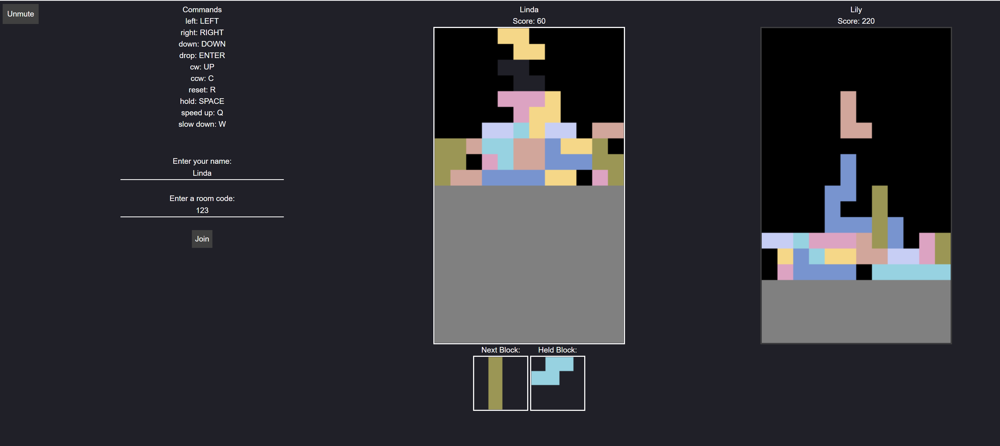
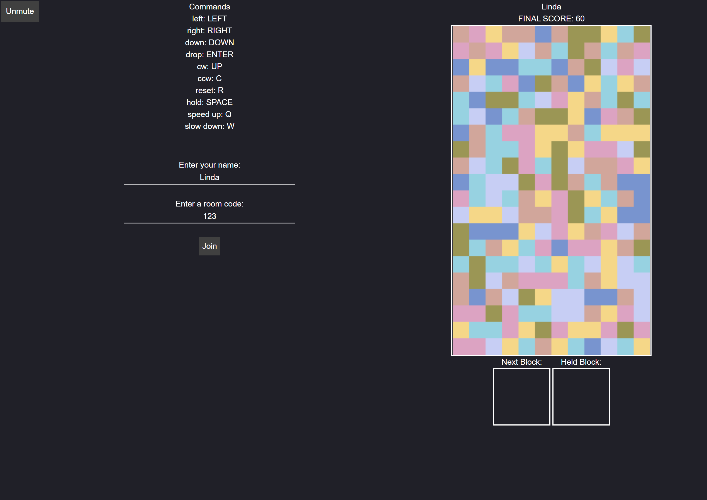

# Tetris

Play Tetris and compete against your friends.

## Where to play
To run this app locally:
1. Clone the repo
2. Run `npm install` to make sure you have the correct dependencies
3. Run `npm start` to start the app
4. Visit http://127.0.0.1:3000/ to play some Tetris!

or feel free to check out the deployed version https://tetris-august-2020.herokuapp.com/

## Images

